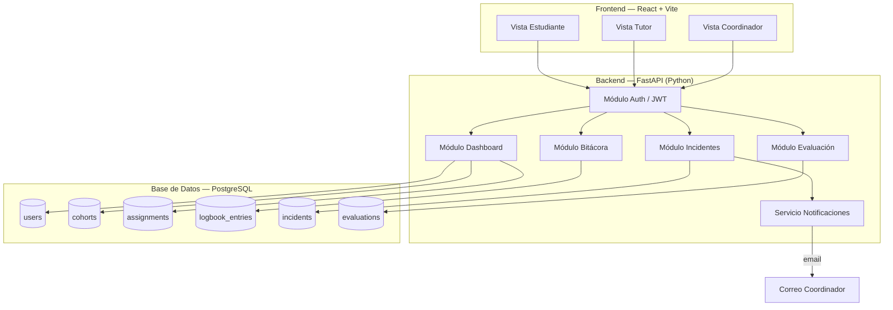
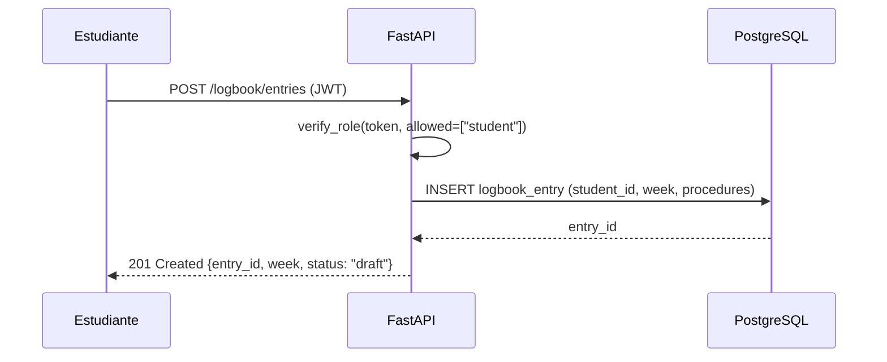
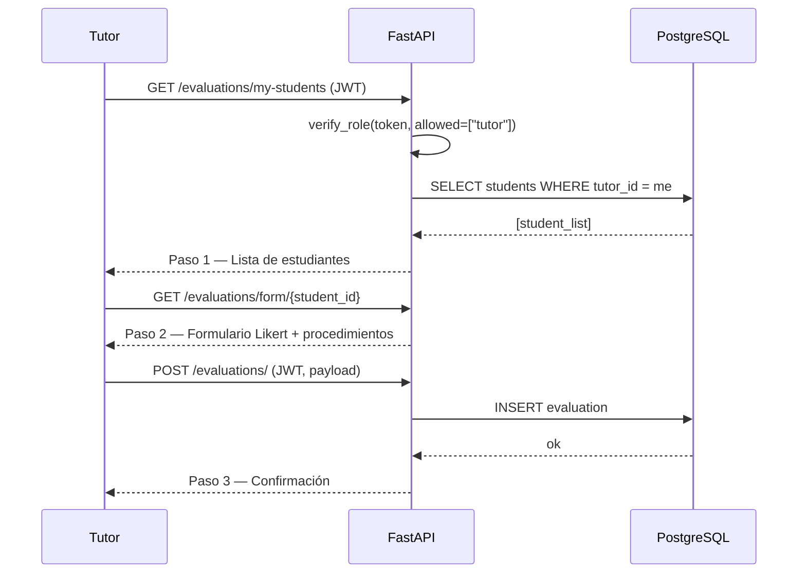
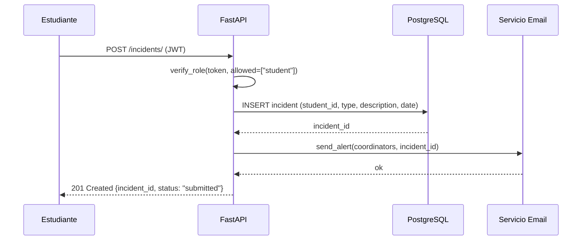

# Documento de Diseño: Plataforma de Internado Odontología UV

## Descripción General

Sistema web para gestionar el internado clínico de estudiantes de 6° año de Odontología de la Universidad de Valparaíso. Permite a los estudiantes registrar su bitácora semanal y reportar incidentes de forma confidencial, a los tutores clínicos externos evaluar con escala Likert, y a los coordinadores UV tener visibilidad completa del proceso con alertas automáticas.

El diseño prioriza tres invariantes: (1) privacidad estricta por rol aplicada en backend, (2) interfaz del tutor con máximo 3 pasos, (3) soporte de múltiples cohortes simultáneas.

---

## Arquitectura General



---

## Diagramas de Secuencia — Flujos Principales

### Flujo: Estudiante escribe bitácora



### Flujo: Tutor evalúa estudiante (máx. 3 pasos)



### Flujo: Estudiante reporta incidente → alerta coordinador



---

## Modelos de Datos

### users

```python
class User(Base):
    __tablename__ = "users"

    id: UUID  # PK
    email: str  # único, usado como login
    hashed_password: str
    full_name: str
    role: Enum("student", "tutor", "coordinator")
    is_active: bool
    created_at: datetime
```

### cohorts

```python
class Cohort(Base):
    __tablename__ = "cohorts"

    id: UUID
    name: str          # ej. "Cohorte 2024-1"
    year: int
    semester: int
    is_active: bool
    created_at: datetime
```

### assignments

```python
class Assignment(Base):
    __tablename__ = "assignments"

    id: UUID
    student_id: UUID   # FK → users (role=student)
    tutor_id: UUID     # FK → users (role=tutor)
    cohort_id: UUID    # FK → cohorts
    clinical_site: str # CESFAM, hospital, etc.
    start_date: date
    end_date: date
    is_active: bool
```

### logbook_entries

```python
class LogbookEntry(Base):
    __tablename__ = "logbook_entries"

    id: UUID
    student_id: UUID   # FK → users
    cohort_id: UUID    # FK → cohorts
    week_number: int
    week_start_date: date
    status: Enum("draft", "submitted", "reviewed")
    created_at: datetime
    updated_at: datetime
    # relación 1:N con logbook_procedures
```

### logbook_procedures

```python
class LogbookProcedure(Base):
    __tablename__ = "logbook_procedures"

    id: UUID
    entry_id: UUID     # FK → logbook_entries
    name: str          # ej. "Extracción simple"
    description: str
    quantity: int      # >= 1
```

### incidents

```python
class Incident(Base):
    __tablename__ = "incidents"

    id: UUID
    student_id: UUID   # FK → users
    incident_type: Enum("abuse", "harassment", "discrimination", "other")
    description: str
    event_date: date
    status: Enum("submitted", "under_review", "resolved")
    created_at: datetime
    updated_at: datetime
    # NUNCA expuesto a tutores — control en backend
```

### evaluations

```python
class Evaluation(Base):
    __tablename__ = "evaluations"

    id: UUID
    tutor_id: UUID     # FK → users (role=tutor)
    student_id: UUID   # FK → users (role=student)
    assignment_id: UUID
    period_label: str  # ej. "Semana 3"
    overall_comment: str | None
    created_at: datetime
    # relación 1:N con evaluation_items
```

### evaluation_items

```python
class EvaluationItem(Base):
    __tablename__ = "evaluation_items"

    id: UUID
    evaluation_id: UUID  # FK → evaluations
    dimension: str       # pendiente definición con Facultad
    score: Enum("achieved", "in_progress", "not_achieved")
    comment: str | None
```

---

## Componentes e Interfaces

### Módulo Auth

**Propósito**: Emitir y validar JWT con claims de rol. Controlar acceso a todos los endpoints.

**Interfaces**:

```python
# Endpoints
POST /auth/login          → TokenResponse
POST /auth/refresh        → TokenResponse
POST /auth/forgot-password → MessageResponse
POST /auth/reset-password  → MessageResponse

# Dependencia reutilizable en FastAPI
def get_current_user(token: str) -> UserInToken: ...
def require_role(*roles: str) -> Depends: ...
```

**Regla crítica**: `require_role("tutor")` en cualquier endpoint de bitácora o incidentes debe retornar `403 Forbidden`, no `404`. Esto evita revelar la existencia del recurso.

### Módulo Bitácora

**Propósito**: CRUD de entradas semanales del estudiante. Invisible para tutores.

```python
GET    /logbook/entries              → List[LogbookEntryOut]  # solo propio (student)
POST   /logbook/entries              → LogbookEntryOut        # student
GET    /logbook/entries/{id}         → LogbookEntryOut        # student o coordinator
PUT    /logbook/entries/{id}         → LogbookEntryOut        # student, solo si status=draft
PATCH  /logbook/entries/{id}/status  → LogbookEntryOut        # coordinator: draft→reviewed

# Coordinador puede ver de cualquier estudiante
GET    /logbook/students/{student_id}/entries → List[LogbookEntryOut]  # coordinator
```

### Módulo Incidentes

**Propósito**: Canal confidencial. Tutor no tiene acceso a ningún endpoint de este módulo.

```python
POST /incidents/                     → IncidentOut   # student
GET  /incidents/my                   → List[IncidentOut]  # student (solo los propios)
GET  /incidents/                     → List[IncidentOut]  # coordinator (todos)
GET  /incidents/{id}                 → IncidentOut   # coordinator
PATCH /incidents/{id}/status         → IncidentOut   # coordinator
```

### Módulo Evaluación

**Propósito**: Tutor evalúa estudiantes asignados. Máximo 3 pasos en UI.

```python
GET  /evaluations/my-students        → List[StudentSummary]  # tutor
GET  /evaluations/form/{student_id}  → EvaluationForm        # tutor
POST /evaluations/                   → EvaluationOut         # tutor
GET  /evaluations/student/{id}       → List[EvaluationOut]   # coordinator o student (solo propias)
```

### Módulo Dashboard (Coordinador)

```python
GET /dashboard/overview              → DashboardStats
GET /dashboard/assignments           → List[AssignmentOut]
POST /dashboard/assignments          → AssignmentOut
PUT  /dashboard/assignments/{id}     → AssignmentOut
GET /dashboard/tutors                → List[TutorOut]
POST /dashboard/tutors               → TutorOut
```

---

## Especificaciones Formales — Funciones Clave

### verify_role()

```python
def verify_role(token: str, allowed_roles: list[str]) -> UserInToken:
    """
    Precondiciones:
    - token es un JWT firmado y no expirado
    - allowed_roles es una lista no vacía de roles válidos

    Postcondiciones:
    - Si token.role in allowed_roles → retorna UserInToken
    - Si token.role NOT in allowed_roles → lanza HTTPException(403)
    - Si token inválido o expirado → lanza HTTPException(401)
    - No produce efectos secundarios
    """
```

### create_logbook_entry()

```python
async def create_logbook_entry(
    entry: LogbookEntryCreate,
    current_user: UserInToken,
    db: AsyncSession
) -> LogbookEntry:
    """
    Precondiciones:
    - current_user.role == "student"
    - entry.week_number >= 1
    - entry.procedures es lista no vacía
    - No existe entrada para (student_id, week_number, cohort_id) con status != "draft"

    Postcondiciones:
    - Se crea LogbookEntry con status="draft"
    - Se crean N LogbookProcedure asociados
    - entry.student_id == current_user.id (no puede crear para otro estudiante)
    - Retorna la entrada creada con sus procedimientos

    Invariante de bucle (inserción de procedimientos):
    - Para todo procedimiento insertado: procedure.entry_id == entry.id
    - procedure.quantity >= 1
    """
```

### submit_incident()

```python
async def submit_incident(
    incident: IncidentCreate,
    current_user: UserInToken,
    db: AsyncSession,
    notifier: NotificationService
) -> Incident:
    """
    Precondiciones:
    - current_user.role == "student"
    - incident.incident_type in ["abuse", "harassment", "discrimination", "other"]
    - incident.description es string no vacío
    - incident.event_date <= date.today()

    Postcondiciones:
    - Se crea Incident con status="submitted", student_id=current_user.id
    - Se envía notificación a todos los coordinadores activos
    - El tutor del estudiante NO recibe ninguna notificación
    - Retorna el incidente creado (sin exponer datos del tutor)
    """
```

### get_logbook_entries() — control de acceso

```python
async def get_logbook_entries(
    student_id: UUID,
    current_user: UserInToken,
    db: AsyncSession
) -> list[LogbookEntry]:
    """
    Precondiciones:
    - current_user.role in ["student", "coordinator"]
    - Si role == "student": student_id == current_user.id

    Postcondiciones:
    - Si role == "student": retorna solo entradas propias
    - Si role == "coordinator": retorna todas las entradas del student_id dado
    - Si role == "tutor": NUNCA llega aquí (bloqueado en router con 403)
    - Resultado ordenado por week_number ASC
    """
```

---

## Pseudocódigo — Algoritmos Principales

### Algoritmo: Login y emisión de JWT

```pascal
PROCEDURE login(email, password)
  INPUT: email: String, password: String
  OUTPUT: TokenResponse OR Error

  SEQUENCE
    user ← db.query(User).filter(email = email, is_active = true)

    IF user IS NULL THEN
      RETURN Error(401, "Credenciales inválidas")
    END IF

    IF NOT verify_password(password, user.hashed_password) THEN
      RETURN Error(401, "Credenciales inválidas")
    END IF

    payload ← {
      sub: user.id,
      role: user.role,
      exp: now() + ACCESS_TOKEN_EXPIRE_MINUTES
    }

    access_token ← jwt.encode(payload, SECRET_KEY, algorithm="HS256")

    RETURN TokenResponse(access_token, token_type="bearer")
  END SEQUENCE
END PROCEDURE
```

### Algoritmo: Validación de acceso a bitácora

```pascal
PROCEDURE get_student_logbook(student_id, current_user)
  INPUT: student_id: UUID, current_user: UserInToken
  OUTPUT: List[LogbookEntry] OR Error

  SEQUENCE
    IF current_user.role = "tutor" THEN
      RETURN Error(403, "Acceso denegado")
    END IF

    IF current_user.role = "student" AND current_user.id ≠ student_id THEN
      RETURN Error(403, "Solo puedes ver tu propia bitácora")
    END IF

    entries ← db.query(LogbookEntry)
                .filter(student_id = student_id)
                .order_by(week_number ASC)

    RETURN entries
  END SEQUENCE
END PROCEDURE
```

### Algoritmo: Edición de entrada de bitácora

```pascal
PROCEDURE update_logbook_entry(entry_id, updates, current_user)
  INPUT: entry_id: UUID, updates: LogbookEntryUpdate, current_user: UserInToken
  OUTPUT: LogbookEntry OR Error

  SEQUENCE
    entry ← db.get(LogbookEntry, entry_id)

    IF entry IS NULL THEN
      RETURN Error(404, "Entrada no encontrada")
    END IF

    IF entry.student_id ≠ current_user.id THEN
      RETURN Error(403, "No puedes editar entradas de otro estudiante")
    END IF

    IF entry.status ≠ "draft" THEN
      RETURN Error(409, "Solo se pueden editar entradas en estado borrador")
    END IF

    entry.procedures ← updates.procedures
    entry.updated_at ← now()

    db.commit()
    RETURN entry
  END SEQUENCE
END PROCEDURE
```

### Algoritmo: Evaluación del tutor (flujo 3 pasos)

```pascal
PROCEDURE submit_evaluation(student_id, form_data, current_user)
  INPUT: student_id: UUID, form_data: EvaluationCreate, current_user: UserInToken
  OUTPUT: Evaluation OR Error

  SEQUENCE
    // Verificar que el tutor tiene asignado a este estudiante
    assignment ← db.query(Assignment)
                   .filter(tutor_id = current_user.id,
                           student_id = student_id,
                           is_active = true)

    IF assignment IS NULL THEN
      RETURN Error(403, "Este estudiante no está asignado a ti")
    END IF

    evaluation ← Evaluation(
      tutor_id = current_user.id,
      student_id = student_id,
      assignment_id = assignment.id,
      period_label = form_data.period_label,
      overall_comment = form_data.overall_comment
    )

    FOR each item IN form_data.items DO
      ASSERT item.score IN ["achieved", "in_progress", "not_achieved"]
      evaluation.items.add(EvaluationItem(
        dimension = item.dimension,
        score = item.score,
        comment = item.comment
      ))
    END FOR

    db.add(evaluation)
    db.commit()
    RETURN evaluation
  END SEQUENCE
END PROCEDURE
```

---

## Propiedades de Corrección

```python
# P1: Un tutor NUNCA puede obtener entradas de bitácora
assert all(
    response.status_code == 403
    for response in [client.get(f"/logbook/entries", headers=tutor_headers),
                     client.get(f"/logbook/students/{any_id}/entries", headers=tutor_headers)]
)

# P2: Un tutor NUNCA puede ver incidentes
assert all(
    response.status_code == 403
    for response in [client.get("/incidents/", headers=tutor_headers),
                     client.get(f"/incidents/{any_id}", headers=tutor_headers)]
)

# P3: Un estudiante solo puede ver su propia bitácora
assert client.get(
    f"/logbook/students/{other_student_id}/entries",
    headers=student_headers
).status_code == 403

# P4: Solo se pueden editar entradas en estado "draft"
assert client.put(
    f"/logbook/entries/{reviewed_entry_id}",
    headers=student_headers,
    json=update_payload
).status_code == 409

# P5: Un tutor solo puede evaluar estudiantes que tiene asignados
assert client.post(
    "/evaluations/",
    headers=tutor_headers,
    json={**eval_payload, "student_id": unassigned_student_id}
).status_code == 403

# P6: Al crear un incidente, todos los coordinadores activos reciben notificación
# (verificado con mock del servicio de email)
assert notification_service.send_alert.call_count == len(active_coordinators)

# P7: El JWT contiene el rol correcto y no puede ser alterado
decoded = jwt.decode(token, SECRET_KEY, algorithms=["HS256"])
assert decoded["role"] in ["student", "tutor", "coordinator"]
```

---

## Manejo de Errores

### Escenario 1: Acceso no autorizado por rol

- **Condición**: Usuario con rol incorrecto intenta acceder a recurso restringido
- **Respuesta**: `403 Forbidden` con mensaje genérico (no revelar existencia del recurso)
- **Recuperación**: El frontend redirige al dashboard del rol correspondiente

### Escenario 2: Token expirado

- **Condición**: JWT expirado en cualquier request autenticado
- **Respuesta**: `401 Unauthorized` con `{"detail": "Token expirado"}`
- **Recuperación**: Frontend intenta refresh; si falla, redirige a login

### Escenario 3: Edición de entrada revisada

- **Condición**: Estudiante intenta editar entrada con `status != "draft"`
- **Respuesta**: `409 Conflict` con mensaje explicativo
- **Recuperación**: Frontend muestra mensaje al usuario, deshabilita botón de edición

### Escenario 4: Tutor evalúa estudiante no asignado

- **Condición**: `assignment` no existe o `is_active = false`
- **Respuesta**: `403 Forbidden`
- **Recuperación**: Frontend solo muestra estudiantes asignados activos (validación doble)

### Escenario 5: Fallo en envío de notificación de incidente

- **Condición**: Servicio de email no disponible al crear incidente
- **Respuesta**: El incidente se guarda igual (`201 Created`); el fallo de email se loguea
- **Recuperación**: Job de reintento asíncrono (o revisión manual por coordinador)

---

## Estrategia de Testing

### Tests Unitarios

- Funciones de hashing y verificación de contraseñas
- Lógica de `verify_role()` con distintos roles y tokens
- Validaciones de modelos Pydantic (schemas de entrada)
- Lógica de negocio: edición solo en draft, asignación activa requerida

### Tests de Propiedades (Property-Based Testing)

**Librería**: `hypothesis` (Python)

- Para cualquier token con `role="tutor"`, todos los endpoints de bitácora e incidentes retornan 403
- Para cualquier `student_id` distinto al del token, el endpoint de bitácora retorna 403
- Para cualquier entrada con `status != "draft"`, el endpoint de edición retorna 409
- Para cualquier evaluación con `student_id` no asignado al tutor, retorna 403

### Tests de Integración

- Flujo completo login → crear bitácora → coordinador revisa → estudiante no puede editar
- Flujo completo login → crear incidente → coordinador recibe alerta → cambia estado
- Flujo completo tutor → ver estudiantes → evaluar → confirmación

---

## Consideraciones de Seguridad

- Contraseñas hasheadas con `bcrypt` (via `passlib`)
- JWT firmado con `HS256`; secret en variable de entorno, nunca en código
- Validación de rol en **backend** para cada endpoint sensible (no solo en UI)
- Respuestas de error genéricas para no revelar existencia de recursos a roles no autorizados
- CORS configurado para aceptar solo el origen del frontend en producción
- Rate limiting en endpoints de login para mitigar fuerza bruta
- Variables de entorno para credenciales de DB, secret JWT y configuración de email

---

## Consideraciones de Performance

- Índices en `logbook_entries(student_id, week_number)` y `incidents(student_id)` y `assignments(tutor_id, student_id, is_active)`
- Paginación en endpoints de listado del coordinador (parámetros `skip` / `limit`)
- Queries async con `SQLAlchemy async` + `asyncpg`

---

## Dependencias Principales

| Paquete | Uso |
|---|---|
| `fastapi` | Framework web |
| `sqlalchemy[asyncio]` | ORM async |
| `asyncpg` | Driver PostgreSQL async |
| `alembic` | Migraciones de base de datos |
| `pydantic` | Validación de schemas |
| `python-jose` | JWT |
| `passlib[bcrypt]` | Hashing de contraseñas |
| `fastapi-mail` | Envío de emails |
| `hypothesis` | Property-based testing |
| `pytest-asyncio` | Tests async |
| `react` + `vite` | Frontend |
| `axios` | HTTP client en frontend |
| `react-router-dom` | Routing frontend |
